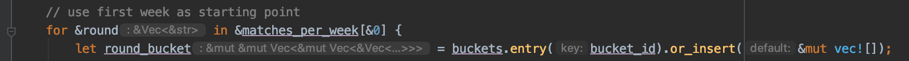

# Learning rust

## Journey
### Goals
I started this journey to practice with learning new languages and getting more experience with different programming paradigms. Because i am already quite familiar with the Objected Oriented paradigm this journey is focused on a more functional approach. 
### Why rust
The first step of this journey was choosing the programming language. When searching for options i looked through a few repositories of tools that i like using and repositories of rapid innovating companies such as Netflix and cloudflare. 
I looked at [kubernetes](https://github.com/kubernetes/kubernetes), [docker](https://github.com/docker/engine), [prometheus](https://github.com/prometheus/prometheus), [wrangler](https://github.com/cloudflare/wrangler), [quiche](https://github.com/cloudflare/quiche) and [rend](https://github.com/Netflix/rend). After scrolling through the repositories I watched a [few youtube video's](https://www.youtube.com/watch?v=FYGS2q1bljE) that address common questions about the language and corresponding eco-system.

One common factor between these repositories is that they are quite new and are already really popular, use fast but not as low-level as the C language and focus on creating memory safe applications. The most commonly used languages in these repositories are [Go](https://golang.org/) and [Rust](https://www.rust-lang.org/), both provide type safety as a compiled language and a comprehensive eco-system. 
Both eco-systems provide enough tools to get started quickly and focus on delivering features instead of writing low-level code without a massive impact on performance.

I chose rust over Go because it has a unique approach for handling memory and has immutable data as a core feature of the language. Another reason for choosing rust was the quite high-level language constructs(no need to mess around pointers) with great performance, this enabled me to focus on creating features instead of worrying about memory and data mutation.

### Learning Rust
When learning a language i prefer to start with learning the syntax and grasping the concepts. The official rust site provides a compact but comprehensive [book](https://doc.rust-lang.org/book/title-page.html) about the language. It covers the basic concepts like syntax but also covers more advanced concepts like multi-threaded applications and pointers.

The book was easy to follow and provided enough examples to see how the concepts can be used. While reading the book i focused on concepts from the functional programming paradigm such as immutability, pure functions and composition.
To improve my understanding of certain more complicated subjects i created summaries about each topic while reading the book. These summaries have been [added at the bottom](#key-concepts) of this document.

After learning the basic concepts i tend to start trying out things and see how they work. I started with trying the various concepts such as for/while/structs/arrays/logs in [small files](https://github.com/MaartenGDev/learning-rust/tree/practice-files) that were explained in [a tutorial](https://www.youtube.com/watch?v=zF34dRivLOw). 
All these examples were quite easy to implement so i started trying to create some brute-force algorithms. This seemed straight forward at first but turned out quite hard because of the unique memory management techniques from rust.

The hard part when working with Rust is dealing with data lifetimes and ensuring no memory cleanup is required. Data in rust can be passed around using various approaches such as: move, borrowing and Mutable borrowing. Each of these have advantages and disadvantages.
The move operation moves the ownership of the object to the receiver. An example is demonstrated below:
```rust
pub fn run() {
   let test = String::from("Example here"); // Create new string object
    move_ownership(test);

    // Fails because the object no longer exist because it was moved in move_ownership
    println!("{:#?}", test);
}


fn move_ownership(data: String) -> String { // data comes into scope
     data
} // Here, the data parameter goes out of scope and the data is removed from memory
```

Because moving the object is often not the desired a object can be borrowed:
```rust
pub fn run() {
   let test = String::from("Example here"); // Create new string object
    borrow_value(&test);

    // Succeeds because the `borrow_value` borrowed the value and thus has not moved it.
    println!("{:#?}", test);
}


fn borrow_value(data: &String) -> &String { // data comes into scope
     data
} // Here, the data parameter returns the provided reference instead of disposing the object.
```

These concept seem quite easy to use when trying them in small examples but can turn out quite complicated when creating a more complex algorithm.
I tried to use [mutable references](https://doc.rust-lang.org/book/ch04-02-references-and-borrowing.html#mutable-references) to be able to pass data without transferring the ownership and to enable updating the data. But this turned out to be way to complicated when trying to learn rust.
I did end up using multiple mutable Vectors with nested mutable Vectors, this didn't work out because the algorithm was too complicated as a starting point. The algorithm was too complicated because i tried to move references inside references that updated references in my solution, this resulted in the following type definition:



### The challenge
Because the brute-force algorithm was a quite complicated start i decided to switch it up and define a clearer and more practical challenge. Instead of following a tutorial I wanted to try and implement a system that focuses on a real world use-case and thus requires the use of the eco-system and best-practices.
The final product will be an trimmed down version of the popular kubernetes platform. Kubernetes is the production grade container orchestration solution that is used for automating deployments with docker as part of the devops mindset. 

I chose this project because I have worked with kubernetes for deploying my own production cluster and loved using it and the reasoning behind the product. Kubernetes has the following core concepts:
- Client provides a desired state, the desired state defines:
    - which (docker) containers should run
    - the amount of containers and how they can be reached
    -  deployment strategies(Blue-Green/Canary)
- Infrastructure as code
    - the client defines what should be running, not how
    - kubernetes takes care of versioning, deployments and high availability.
    
To put it simply, it helps the architects to easily deploy and manage systems and it is especially well suited for a microservice architecture. My goal this project is to take the core principles of kubernetes and make my own implementation.
By creating my own basic implementation i get to use various libraries for HTTP(server + client) and can practice with writing functional code for the business logic.

A more concrete definition is outlined below:
- Controlplane API
    - accept json files that describe various types:
        - services
            - port
            - number of containers
            - container attributes
        - loadbalancer
            - domain-name
            - which services to use
    - uses [hyper](https://github.com/hyperium/hyper) as HTTP server and [reqwest](https://github.com/seanmonstar/reqwest) as HTTP client.
- Scheduling service
    - checks if the desired state matches the current state

### Working on the challenge
Aside from writing the business logic it is important to focus on using a different paradigm, is this case functional. Because Rust is a multi-paradigm language extra care has to be taken to ensure the use of function patterns instead of using objects because these are more familiar.
To enforce using the function aspects of the language i created a few guidelines that state a few best practices:

1. Functions/Methods should be pure, and thus have no side effects(every call with the same input returns the same result).
2. Data is immutable, when changing a structure a copy should be made with the changes instead of mutating the original structure.
3. No shared state, the data should be passed around instead of storing it in a global space.
4. Composition is preferred
5. Uses recursion or higher order functions to iterate over collection data instead of using a loop.
6. Passing around functions instead of abstracting it to classes.

Most of these constraints are quite easy to follow in Rust because data is immutable by default and [using closures](https://doc.rust-lang.org/book/ch13-00-functional-features.html) in combination with higher order functions `map` and `filter` is recommended:
```rust
let numbers: Vec<i32> = vec![1, 2, 3];
let updated_numbers: Vec<_> = numbers.iter().map(|x| x + 1).collect();
``` 

Variables defined using `let` are immutable by default, to be able to mutate the value creating a copy is required. Another option is to explicitly mark the value as `mutable`:
```rust
let val = 1;
val = 22; // Error, reassignment of immutable variable
```
After marking it as mutable:
```rust
let mut x = 3;
x = 5; // Works fine
```

writing docker client:
https://github.com/softprops/shiplift
https://www.youtube.com/watch?v=NBBIu8JkxGs

Catching errors
```commandline
error[E0382]: borrow of moved value: `test`
 --> src/memory.rs:5:23
  |
2 |    let test = String::from("Example here");
  |        ---- move occurs because `test` has type `std::string::String`, which does not implement the `Copy` trait
3 |     move_ownership(test);
  |                    ---- value moved here
4 | 
5 |     println!("{:#?}", test);
  |                       ^^^^ value borrowed here after move
```

            

## Key concepts
### References
- https://doc.rust-lang.org/book/ch04-02-references-and-borrowing.html

In the various language i have worked with such as PHP and C# there is no need to think about references, copies and pointers. 
You just assign the variable and it works. When working with Rust and you try copying some objects you get a compile time error that the variable is out of scope of can't be mutated.
Without reading the documentation it is quite hard to grasp why these errors occur and how to fix them, after reading the references and borrowing chapter it became way more clear. 

Rush takes a unique approach in managing memory, it checks where which memory will be used at compile and what values will be available. Because of this the program is way more performant and doesn't need to garbage collect at  run time. 

Borrowing an instance using `&` is preferred because it allows the instance to be used later. When using methods in struct implementation `self` is passed as borrowed/non-mutable(`&self`) because changing the object itself to a new instance almost never happens.
To pass it as mutable reference the following can be used `&mut self`, this will cause the pointer to be moved and will no longer be available if the method runs out of scope.    

When using methods the syntax for instance and non-instance functions is the same. The only difference is the addition of `self` for instance method. If the method signature doesn't contain a `self` parameter it is marked as a associated function. Associated functions can be called without an instance but are bound to the struct.
A instance function can be called using the `instance.method` syntax and an associated function can be called using the double colon syntax: `Rectangle::square()`.

### Enums
- https://doc.rust-lang.org/book/ch06-01-defining-an-enum.html

Rust has enums that look familiar to syntax of other languages such as C# and Java but have a few key differences. One major difference is that they can be used to store values in a specific enum type:
```rust
enum IpAddr {
    V4(String),
    V6(String),
}

let home = IpAddr::V4(String::from("127.0.0.1"));

let loopback = IpAddr::V6(String::from("::1"));
```

### Namespaces
Rust projects have various ways to structure code, the top level construct is a Package, these contain crates. Each crate produces a library or executable.
The code in a crate gets structured using modules that determine what parts can be used and which parts are internal/private. These modules can be accessed using the `use` keyword.
When exposing code from a module `Paths` can be used to specify how it should be named. 

When using function the best practice is to import the module it is in instead of the functions. This way it is clear that the function isn't placed in the current file but in an imported module(`namespace::my_function`). When using Structs or enum it is recommended to import them directly to make the code less verbose(`use std::collections::HashMap`, `HashMap::new()`).
Because module names have to be unique the `as` keyword can be used to alias to non-unique names:
```rust
use std::fmt::Result;
use std::io::Result as IoResult;
```

### Generics
Rust has support for generic, these can be used to prevent duplicate code and allow the `structs` and `functions` different types. In most other languages this causes an overhead because it needs to determine the type on run-time. 
Rust uses a process called `monomorphization` to determine the possible concrete types for generics and generates the concrete implementations. Because of this the generic value doesn't have to be determined at run-time, this means no run-time impact. 

### Traits
Code can be reused or enforced to conform to a specific format using `traits`. Traits look simular to structs but they differ because function implementations are not required in `traits`. An example trait would be a `Summary` that would contain the method signature for `fn summarize(&self) -> String;` this would enforce every concrete implementation to implement the method:
```rust
impl Summary for School {
    fn summarize(&self) -> String {
        format!("{} is located in {}", self.name, self.location)
    }
}
```

Another powerful feature is the short syntax sugar for using it as requirement(see `T`) for a generic. Example without the short-hand syntax:
```rust
pub fn notify<T: Summary>(item: T) {
    println!("Breaking news! {}", item.summarize());
}
```

with syntax sugar:
```rust
pub fn notify(item: impl Summary) {
    println!("Breaking news! {}", item.summarize());
}
```

Because it is so common to restrict the `type` arguments the `impl` sugar really cleans up the code.

### Testing
Rust provides testing utilities by default such as `assert!`, `assert_eq!` and `assert_ne!`. Code can be tested by annotating the method with `#[test]` and the module with `#[cfg(test)]`. A test will be marked successful if there hasn't been a `panic`. Panics can be caused if the `assert_*` macro's evaluate to false. Checkout the following examples:
```rust
mod tests {
    #[test]
    fn it_adds_two() {
        assert_eq!(4, 2 + 2); // OK
        assert_eq!(4, 2); // Panic because of assert_eq!, FAILS
    }
}
```

It is also possible to test if a piece panics. Panicking is something the desired behaviour if the program ends up in a faulty state. To test if the code `panicks` the following annotation can be used: `#[should_panic]`

### Next
I stopped reading at [ch15-00-smart-pointers.html](https://doc.rust-lang.org/book/ch15-00-smart-pointers.html) because it felt i had solid understanding of the basic concepts. To practice with acquired knowledge I defined a global outline of my practice project at the top of this document. I will document the process, including the struggles of this project in the same document.